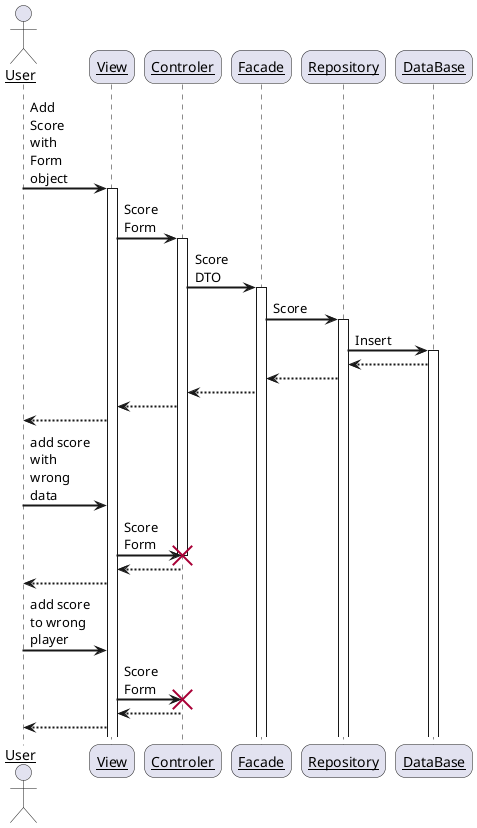

 # Dokumętacja aplikacji wspomagającej działanie ligi squasha 

#### Celem aplikacji jest umożliwienie wprowadzania oraz przechowywania wyników meczy ligi squash'a. Zawodnicy są podzieleni na grupy, w których w ciągu rundy odbywają mecz z każdym zawodnikiem z danej grupy. Wprowadzanie wyników jest dostępne dla admina jak i dla użytkownika(gracza) lecz użytkownik może zmieniać tylko i wyłącznie mecze w których brał udział. Po zakończeniu rundy trchwającej miesiąc program zajmuje się odpowiednim umieszczeniem zawodników w grupach w następnej rundzie. Zawodnik z pierwszego miejsca w grupie awansuje do grupy, a zawodnik z ostatniego miejsca w grupie spada o grupę niżej.

## Główne Funkcjonalności:
  - ### Sortowanie Graczy w Grupach wg. ilości punktów
 - ### Przejścia między grupami
   - #### Rozwiązane za pomocą dodania dodatkowej encji zawierającej właśnie regóły dotyczące przejść między grupami.
 - ### Dodawanie nowych graczy i wyników
   - #### Dwa formularze stworzone w osobnych klasach definiujących ich zawarość.  
 - ### Logowanie do Aplikacji
   - #### Wymagało stworzenia Formularza, który wpuszcza do strony zawodników tylko pasujących do hasła.

## Diagram przedstawiający działanie aplikacji dla wprowadzania wyniku: 



## Technologie wykorzystywane w projekcie:

 - ### Baza danych MySQL
 - ### Język programowania Java
 - ### Framework Hibernate
 - ### Framework Spring Boot
 - ### System kontroli wersji Git/GitHub
 - ### Strony internetowe HTML CSS
 - ### Narzędzie automatyzujące budowę oprogramowania Maven
 - ### Serwer Tomcat
 - ### Hosting aplikacji AWS (Amazon Web Services)
 - ### Tworzenie dokumentacji przy pomocy markdown oraz plantuml


 ## Wzorce projektowe wykorzystane w kodzie:
 - ### Fasady
    #### Udostępniają podstawony interfejs pobierając dane o z repozytorium i konwertując je na obiekty tupy DTO
    #### Przykładowe metody z PlayerFacade:
    Metoda pobierająca zawodników z repozytorium po id
    ```
    public PlayerDTO getPlayer(int playerId){

        return convertPlayer(playersRepository.findById(playerId).get());
    }
    ```
    Metoda konwertująca listę zawodników na listę objektów DTO:
    ```
        public List<PlayerDTO> convertPlayers(Iterable<Player> players) {
        List<PlayerDTO> playerDtos = new ArrayList<>();

        players.forEach(player -> playerDtos.add(convertPlayer(player)));

        return playerDtos;
    }
    ```
 - ### Objetky typu DTO (Data transfer object)
    #### Służą do przekazywania objektow do kontrolera
    #### Zawierają: 
    - pola (takie same jak ich encje)
    - gettery/settery
    - metodę toString (zwracającą obiekt mozliwy do wyświetlenia na stronie)
 - ### Kontrolery (Model-View-Controller)
    przekazują objekty DTO do plików JSP 
 - ### Repozytoria (Repository)
    Zawierają dane o encjach.
    Wszystkie rozszerzone są o interfej CrudRepository,
    a niektóre o niestandardowe Repozytorium w którym są napisane metody pobierające dane z bazy danych 
    #### Na przykład
    ``` 
    @Override
    public Groupss getHigherGroup(Groupss sourceGroup){
        Query query = entityManager.createQuery("select g from Groupss as g where g.groupRank= :groupRank");
        query.setParameter("groupRank", sourceGroup.getGroupRank()-1);

        return (Groupss) query.getSingleResult();
    }
    ```
    ta metoda ma za zadanie zwrócić wyrzszą od siebie grupę
## Testy Jednostkowe:
 ### Aby przetestowac poprawnosc działania naszego kodu wykonaliśmy dwa testy jednostkowe sprawdzające poprawność podanych przez użytkownika danych. 
 - ### Pierwszy z nich sprawdza czy podane dane o graczu są prawidłowe:
 
        @Test
        public void ensureThatPlayerDetailsAreRight(){

        //given
        final Player[] createdPlayers = {null};
        Mockito.when(mockPlayersRepository.save(Mockito.any(Player.class))).thenAnswer(i ->
        {
            createdPlayers[0] = (Player) i.getArguments()[0];
             return  i.getArguments()[0];
        });

        PlayerForm playerForm = new PlayerForm();
        playerForm.setName("Wojtek");
        playerForm.setPhoneNumber(123123123);

        //when
        playerController.addPlayer(playerForm, new ModelMap());

        //then
        Player createdPlayer = createdPlayers[0];

        assertEquals(playerForm.getName(), createdPlayer.getName());
        assertEquals(playerForm.getAdress(), createdPlayer.getAdress());
        assertEquals(playerForm.getPhoneNumber(), createdPlayer.getPhoneNumber());
        }
- ### Drugi sprawdza czy punkty podane przez graczy nie są ujemne.
        @Test
        public void ensureThatUserIsNotAllowedToSubmitGameResultsWhereSetNumbersAreNegative(){
        ScoreController scoreController = new ScoreController();

        ScoreForm scoreForm = new ScoreForm();
        scoreForm.setPoints1(-1);
        scoreForm.setPoints2(6);

        String view = scoreController.addScore(scoreForm, new ModelMap());

        assertEquals("scores/addScore", view);
        }
        

## Pomoce przy pisaniu kodu:
### Podczas pisania kodu korzystaliśmy z wielu narzędzi które bardzo ułatwiają prace programisty. 
### Były to narzędzia takie jak:
- ### IntelliJ IDEA
- ### ChatGPT
- ### MySQL Workbench
- ### Oraz pomoc doświadczonego programisty

 ## Użytkownicy Aplikacji
 - ### Administrator
 - ### Gracz
 
 ## Model danych zaprojektowany w Hibernate:
 ```plantuml
 @startuml
' hide the spot
' hide circle

' avoid problems with angled crows feet
skinparam linetype ortho

entity "Player" as p {
  *id : int <<generated>>
  --
  name : varchar
  phoneNumber : varchar
  adress : varchar
}

entity "Group" as gr {
  *id : int <<generated>>
  --
  name : varchar
}
entity "Round" as r {
    *id : int <<generated>>
    --
    name : varchar
}
entity "History" as h {
    *id : int <<generated>>
    --
    playerId : int <<FK>>
    groupId : int <<FK>>
    roundId : int <<FK>>
}
entity "Matches" as m {
    *id : int <<generated>>
    --
    player1 : int <<FK>>
    player2 : int <<FK>>
    roundId : int <<FK>>
}
entity "Scores" as s {
    *id : int <<generated>>
    --
    playerId : int
    matchId: int
    sets: int
    points : int
}
entity "GroupTransitions" as gt {
    *id : int <<generated>>
    --
    position : int
    sourceGroup : int
    targetGroup : int
}

' player relations
p |o..o{ h
p |o..o{ m
p |o..o{ m
p |o..o{ s

' group relations
gr |o..o{ h
gr |o..o{ gt
gr |o..o{ gt

' round relations
r |o..o{ h
r |o..o{ m

' match - score relation
m |o..{ s   

@enduml```


